<div align="center">
  
  <h1>Tailscale Tunnel Manager</h1>
  <p>A self-hosted TCP tunnel manager for Tailscale containers, designed to run on <a href="https://discloud.com">Discloud</a>.</p>
  <p><a href="https://github.com/jackskelt/tailscale-discloud">View on GitHub</a></p>
  <p><a href="DISCLOUD.pt-BR.md">🇧🇷 Versão em Português</a></p>
</div>

<table>
  <tr>
    <td width="50%">
      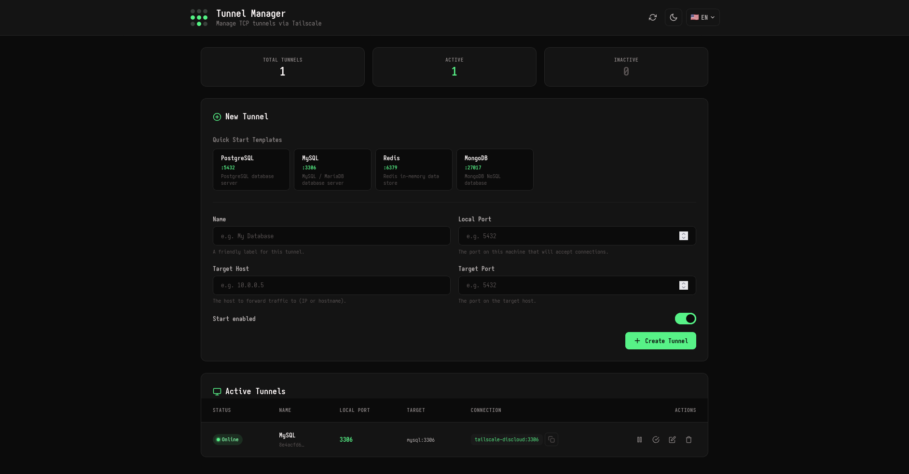
    </td>
    <td width="50%">
      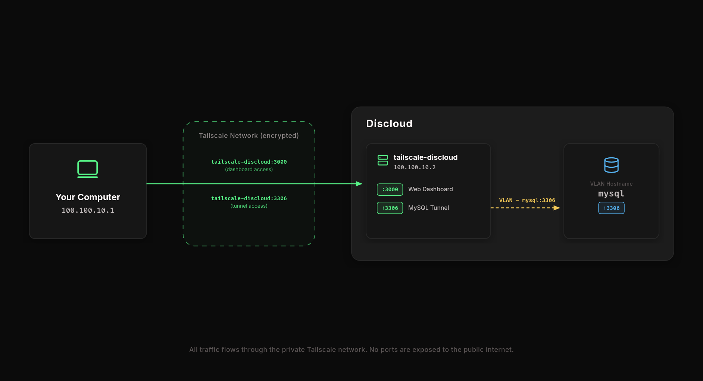
    </td>
  </tr>
</table>

---

## About

Tailscale Tunnel Manager is a lightweight application that lets you create, manage, and monitor TCP tunnels inside a Tailscale-connected container. It exposes local ports on a Tailscale node and forwards traffic to arbitrary hosts and ports using [socat](https://linux.die.net/man/1/socat), all managed through a web interface and a REST API.

The primary use case is running the manager on a Discloud container so that services deployed alongside it (databases, internal tools) become accessible over your Tailscale network without exposing them to the public internet.

## Features

- **Web dashboard** -- Create, edit, toggle, and delete tunnels from the browser. Includes dark and light themes.
- **Quick start templates** -- Pre-configured templates for common services such as PostgreSQL, MySQL, Redis, and MongoDB.
- **Connection testing** -- Test target reachability directly from the UI before or after creating a tunnel.
- **Tunnel persistence** -- Tunnel configuration is saved to disk and automatically restored on container restart. Tunnels that fail to restore are disabled instead of retrying indefinitely.
- **Internationalization** -- The interface is available in English, Portuguese (BR), Spanish, French, German, and Japanese.

## Deploy

### Summary

1. [Setting up Tailscale](#1-setting-up-tailscale)
   1. [Create a Tailscale account](#11-create-a-tailscale-account)
   2. [Install the Tailscale client](#12-install-the-tailscale-client)
   3. [Connect and verify](#13-connect-and-verify)
2. [Deploying to Discloud](#2-deploying-to-discloud)
   1. [Hosting on Discloud](#21-hosting-on-discloud)
      - [Option A: Using the Discloud template (Recommended)](#option-a-using-the-discloud-template-recommended)
      - [Option B: Using the repository zip](#option-b-using-the-repository-zip)
   2. [Find the Tailscale login link](#22-find-the-tailscale-login-link)
   3. [Authorize the node](#23-authorize-the-node)
   4. [Verify the machine on Tailscale](#24-verify-the-machine-on-tailscale)
   5. [Access the web dashboard](#25-access-the-web-dashboard)
3. [Usage — Creating your first tunnel](#3-usage--creating-your-first-tunnel)
   1. [Deploy a MySQL instance from a template](#31-deploy-a-mysql-instance-from-a-template)
   2. [Configure VLAN on the MySQL application](#32-configure-vlan-on-the-mysql-application)
   3. [Open the Tunnel Manager dashboard](#33-open-the-tunnel-manager-dashboard)
   4. [Create a new tunnel](#34-create-a-new-tunnel)
   5. [Verify the tunnel is active](#35-verify-the-tunnel-is-active)
   6. [Get the connection string](#36-get-the-connection-string)
   7. [Connect from your local machine](#37-connect-from-your-local-machine)

---

### 1. Setting up Tailscale

#### 1.1 Create a Tailscale account

Go to [https://tailscale.com](https://tailscale.com) and create a free account. You can sign up with Google, Microsoft, GitHub, or other identity providers.

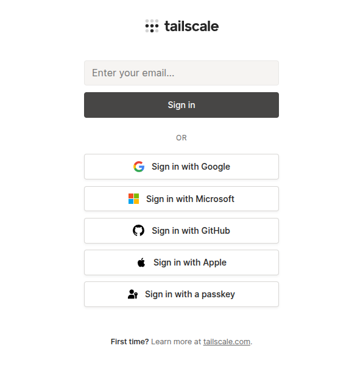

#### 1.2 Install the Tailscale client

Install the Tailscale client on the machine you want to use to access your tunnels (your laptop, desktop, etc.).

Tailscale supports Windows, macOS, Linux, iOS, and Android. Follow the official installation guide for your platform:

📖 **[Tailscale Downloads & Install Guide](https://tailscale.com/download)**

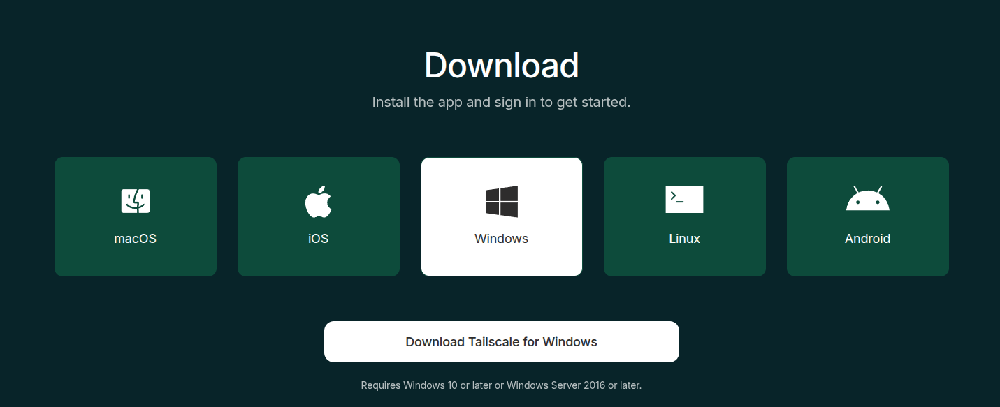

#### 1.3 Connect and verify

After installing, open the Tailscale client and log in with the same account you created in step 1.1.

Once connected, your machine should appear in the Tailscale admin console at [https://login.tailscale.com/admin/machines](https://login.tailscale.com/admin/machines).

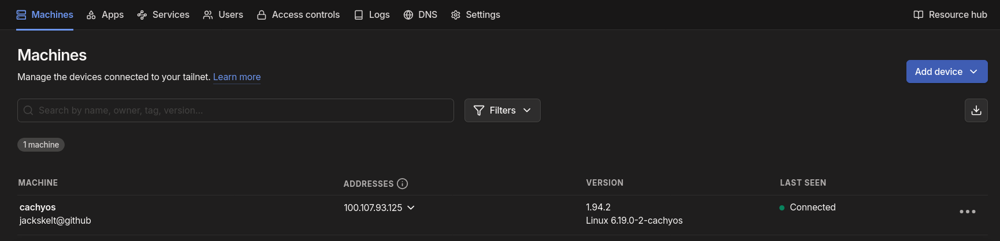

---

### 2. Deploying to Discloud

> **⚠️ Important:** You need a **Diamond** plan or higher to use VLAN on Discloud.

#### 2.1 Hosting on Discloud

There are two ways to deploy Tailscale Tunnel Manager on Discloud. Choose the one that best suits your needs:

- **[Option A: Using the Discloud template](#option-a-using-the-discloud-template-recommended)** — The quickest and easiest way. Deploy directly from the Discloud template with a few clicks.
- **[Option B: Using the repository zip](#option-b-using-the-repository-zip)** — Download a zip from GitHub Releases and upload it manually to Discloud.

---

##### Option A: Using the Discloud template (Recommended)

Go to the [Tailscale template page](https://discloud.com/templates/tailscale-discloud) on Discloud and click **Host Now**. Configure the options to your liking and deploy it.

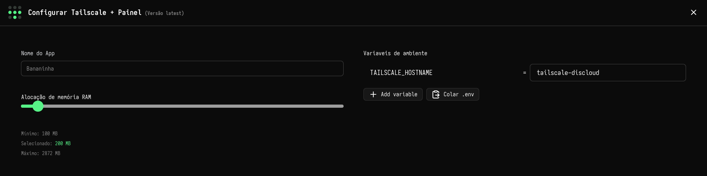

> **⚠️ Important:** The default template hostname is `tailscale-discloud`. If you change the hostname during setup, remember to use the new hostname instead of `tailscale-discloud` when accessing the web dashboard and configuring tunnels later. To avoid confusion, it is recommended to keep the hostname as `tailscale-discloud`.

After deploying, proceed to [step 2.2](#22-find-the-tailscale-login-link).

---

##### Option B: Using the repository zip

<details>
<summary><strong>Click to expand the zip deploy instructions</strong></summary>

<br>

**B.1 Download the deploy zip**

Go to the [GitHub Releases](https://github.com/jackskelt/tailscale-discloud/releases) page and download one of the deploy zips:

- **`deploy-remote.zip`** — Contains only the `Dockerfile` and `discloud.config`. The container downloads the binary from GitHub Releases at build time. Smaller download, but the Docker build requires network access to GitHub.
- **`deploy-static.zip`** — Contains the compiled binary, entrypoint, static files, `Dockerfile`, and `discloud.config`. Fully self-contained; no external downloads during the Docker build.

Both zips follow the exact same deployment steps below. The only difference is how the Docker image is built internally.

> **💡 Tip about updates:** If you use `deploy-remote.zip`, your container will always pull the **latest** release from GitHub when it is rebuilt. With `deploy-static.zip`, the binary is baked into the zip, so you need to download a new zip from Releases and re-upload it to update.

**B.2 Access the Discloud dashboard**

Log in to the Discloud dashboard at [https://discloud.com/dashboard](https://discloud.com/dashboard).

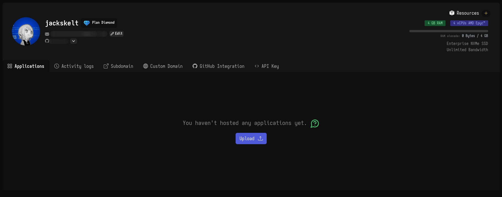

**B.3 Upload the zip**

Click **Add App** (or the upload button) on the Discloud dashboard and upload the zip file you downloaded in step B.1.

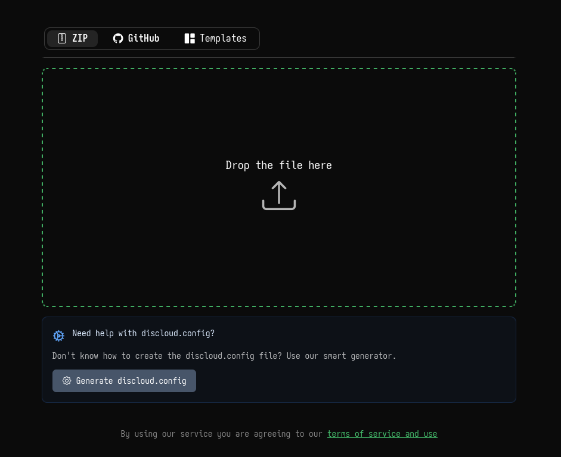

**B.4 Verify if VLAN is enabled on Discloud**

Go to the **Settings** of the Tailscale Tunnel Manager application on the Discloud dashboard. Find the **VLAN** section and check if it is enabled.

This allows the Tailscale container to communicate with other applications on the same Discloud account over the internal network.

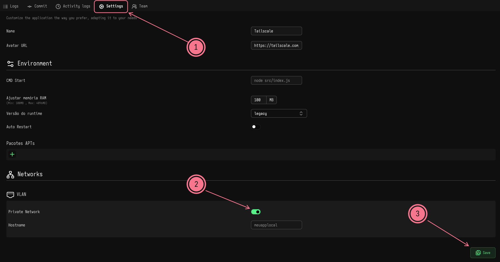

After completing these steps, proceed to [step 2.2](#22-find-the-tailscale-login-link).

</details>

---

#### 2.2 Find the Tailscale login link

After the application starts, go to the **Logs** section of your application and enable **Auto-Reload**. Wait for the logs to show a Tailscale login URL. It will look something like:

```
To authenticate, visit: https://login.tailscale.com/a/XXXXXXXXXX
```

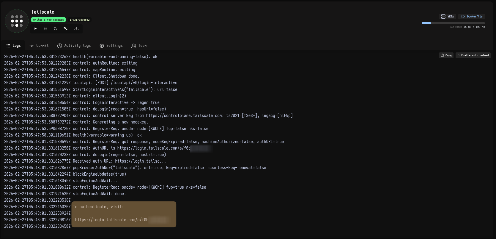

#### 2.3 Authorize the node

Open the Tailscale login URL from the logs in your browser. Log in with the same Tailscale account you created earlier and **approve the connection**.

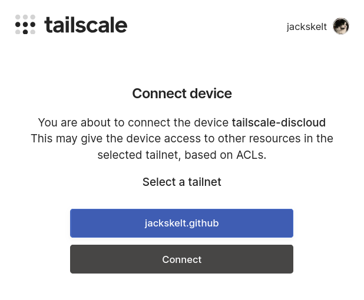

#### 2.4 Verify the machine on Tailscale

Go back to the Tailscale admin console at [https://login.tailscale.com/admin/machines](https://login.tailscale.com/admin/machines) and verify that a new machine called **`tailscale-discloud`** appears in the list.

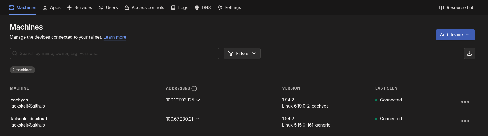

#### 2.5 Access the web dashboard

On your local machine (which is connected to Tailscale), open a browser and navigate to:

```
http://tailscale-discloud:3000
```

You should see the Tailscale Tunnel Manager web dashboard.


---

### 3. Usage — Creating your first tunnel

This example walks through setting up a tunnel to a MySQL instance hosted on Discloud using the official MySQL template.

#### 3.1 Deploy a MySQL instance from a template

Go to the Discloud MySQL template page at [https://discloud.com/templates/1753305454851mysql](https://discloud.com/templates/1753305454851mysql), configure the settings to your liking, and deploy it.

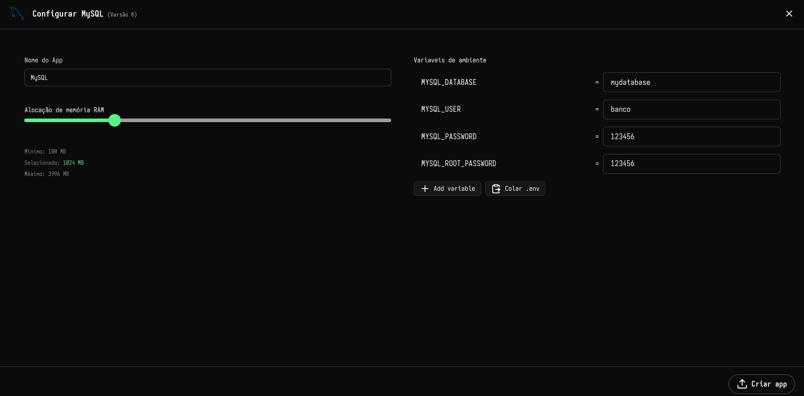

#### 3.2 Configure VLAN on the MySQL application

After the MySQL template is deployed, go to its **Settings** on the Discloud dashboard and navigate to the **VLAN** section.

For the MySQL template, the VLAN is already enabled and the default hostname is **`mysql`**.

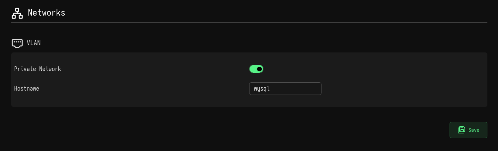

> **⚠️ Important:** For a regular (non-template) application, you need to manually enable VLAN and set a unique hostname. **Do not use duplicate hostnames** across your applications — each application must have a distinct VLAN hostname, otherwise the internal routing will not work correctly.

#### 3.3 Open the Tunnel Manager dashboard

On your local machine, open the Tunnel Manager dashboard in your browser:

```
http://tailscale-discloud:3000
```

#### 3.4 Create a new tunnel

Click **New Tunnel** to create a tunnel. You can select the **MySQL** template from the quick start templates — it comes pre-filled with the default settings for a standard MySQL instance.

Here is what each parameter means:

| Parameter | Description | Example |
| --------- | ----------- | ------- |
| **Name** | A friendly name to identify the tunnel. | `MySQL` |
| **Local Port** | The port exposed on the Tailscale node. This is the port you will connect to from your local machine. You can change it if the default conflicts with something else. | `3306` |
| **Target Host** | The VLAN hostname of the application you want to reach. Must match the hostname configured in the VLAN settings of the target app. | `mysql` |
| **Target Port** | The port the target application is listening on. | `3306` |


> **💡 Tip:** You can change the **Local Port** to any available port if the default one is already in use on the tailscale instance. The **Target Host** and **Target Port** must match the VLAN hostname and listening port of the destination application.

#### 3.5 Verify the tunnel is active

After creating the tunnel, check the **Active Tunnels** section on the dashboard. Your MySQL tunnel should appear with an **Online** status.

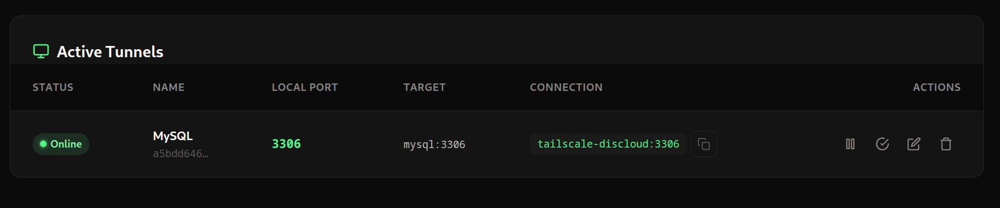

#### 3.6 Get the connection string

In the **Active Tunnels** table, look at the **Connection** column. It shows the address you should use to connect to the service from your local machine.

For the default MySQL template, the connection string will be:

```
tailscale-discloud:3306
```

This means:

- **Host / Hostname / Domain:** `tailscale-discloud`
- **Port:** `3306`

Use these values in any MySQL client, application, or connection string.

#### 3.7 Connect from your local machine

Open your preferred database client (this example uses **Tabularis**) and create a new connection using the tunnel's connection details:

- **Host:** `tailscale-discloud`
- **Port:** `3306`
- **User / Password:** The credentials you configured when deploying the MySQL template.

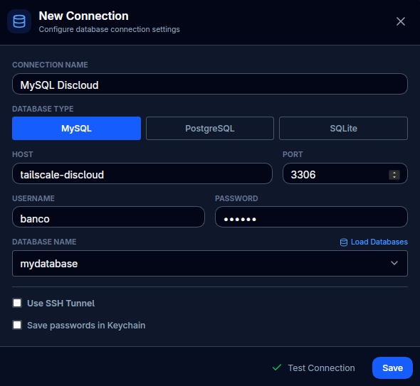

That's it! Your MySQL instance running on Discloud is now securely accessible from your local machine through the Tailscale network.
